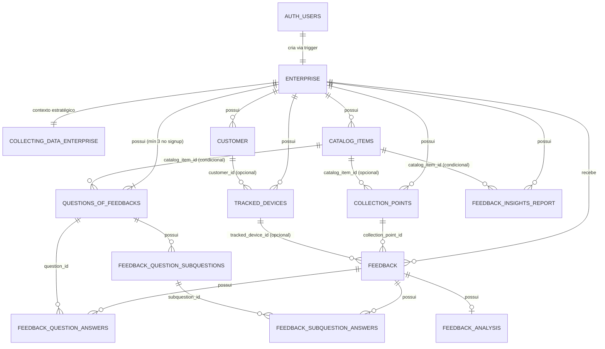

# Banco de Dados — Visão Geral e Arquitetura

> Documentação técnica do schema PostgreSQL hospedado no Supabase. Cobre todas as tabelas, relacionamentos, políticas de segurança (RLS), funções, triggers e índices do sistema.

---

## Sumário

1. [Visão Geral](#visão-geral)
2. [Tecnologia e Infraestrutura](#tecnologia-e-infraestrutura)
3. [Diagrama de Entidades (ERD)](#diagrama-de-entidades-erd)
4. [Domínios e Grupos de Tabelas](#domínios-e-grupos-de-tabelas)
5. [Referência de Tabelas](#referência-de-tabelas)
6. [Funções e Stored Procedures](#funções-e-stored-procedures)
7. [Triggers](#triggers)
8. [Segurança e RLS](#segurança-e-rls)
9. [Índices e Performance](#índices-e-performance)
10. [Regras de Integridade e Constraints](#regras-de-integridade-e-constraints)
11. [Storage](#storage)

---

## Visão Geral

O banco de dados é a camada de persistência central da plataforma. A lógica de isolamento multi-tenant, autorização e integridade referencial é aplicada diretamente no banco (RLS, constraints e triggers), garantindo segurança em profundidade. Já o controle **anti-spam** de feedback é aplicado na **camada de aplicação** (API Gateway): o banco oferece a estrutura de apoio (tabela `tracked_devices` e funções auxiliares), mas o cálculo do fingerprint e o limite diário são verificados no Gateway.

**Princípios arquiteturais:**

- **Multi-tenancy por RLS:** cada linha de dados está vinculada a um `enterprise_id`; o PostgreSQL aplica Row Level Security automaticamente em todas as queries, prevenindo o vazamento entre empresas mesmo em caso de falha na camada de aplicação.
- **Fonte única de verdade para segurança:** as políticas RLS são a última barreira de defesa — mesmo se o API Gateway for comprometido, o banco recusa acessos indevidos.
- **Integridade por cascata:** deleções propagam-se via `ON DELETE CASCADE` para manter consistência sem operações manuais.
- **Imutabilidade de mídias:** arquivos de Storage são protegidos contra exclusão por trigger, garantindo rastreabilidade histórica.
- **Onboarding automático:** ao criar conta, um trigger semeia automaticamente as 3 perguntas institucionais padrão para a empresa.

---

## Tecnologia e Infraestrutura

| Item | Detalhe |
|---|---|
| **Banco** | PostgreSQL (gerenciado pelo Supabase) |
| **Autenticação** | Supabase Auth (`auth.users`) — JWT com claims customizados |
| **Segurança** | Row Level Security (RLS) habilitado em todas as tabelas públicas |
| **Storage** | Supabase Storage (buckets com triggers de proteção) |
| **Schema principal** | `public` |
| **Schema de autenticação** | `auth` (gerenciado pelo Supabase) |
| **Extensões usadas** | `gen_random_uuid()`, `pg_advisory_xact_lock()`, `md5()` |

---

## Diagrama (ER)
[Imagem gerada a partir do DBeaver](https://drive.google.com/file/d/1aVd_KDQH1kX06L_hKiHndOnY3fKLu0Lt/view?usp=sharing)

---

## Diagrama de Entidades (ERD)

> **Legenda de cardinalidade:** `||` = exatamente 1 · `o|` = 0 ou 1 (opcional) · `|{` = 1 ou muitos · `o{` = 0 ou muitos.

**Visualizar o código no site: https://mermaid.ai/** 



> Todas as tabelas possuem `enterprise_id` FK obrigatória (isolamento RLS multi-tenant), **exceto**: `feedback_question_subquestions`, `feedback_question_answers`, `feedback_subquestion_answers` e `feedback_analysis` — isolamento herdado via cascade da tabela pai.

---

## Domínios e Grupos de Tabelas

| Domínio | Tabelas | Responsabilidade |
|---|---|---|
| **Identidade** | `auth.users`, `enterprise` | Autenticação e raiz de autorização multi-tenant |
| **Contexto Analítico** | `collecting_data_enterprise` | Dados estratégicos injetados nos prompts de IA |
| **Catálogo** | `catalog_items`, `collection_points` | Produtos/Serviços/Departamentos e QR Codes |
| **Formulário** | `questions_of_feedbacks`, `feedback_question_subquestions` | Perguntas dinâmicas exibidas no formulário público |
| **Coleta** | `feedback`, `feedback_question_answers`, `feedback_subquestion_answers` | Dados brutos dos clientes finais |
| **Anti-spam** | `tracked_devices`, `customer` | Rastreio de dispositivos e identificação opcional de clientes |
| **Inteligência Artificial** | `feedback_analysis`, `feedback_insights_report` | Resultados e relatórios do motor de IA |

---

## Referência de Tabelas

> A coluna **Impacto no Projeto** indica qual parte do sistema consome cada campo e o que é afetado se ele for alterado ou removido.

### `auth.users`

> Schema gerenciado pelo Supabase. Tabela central de autenticação.

| Coluna | Tipo | Descrição | Impacto no Projeto |
|---|---|---|---|
| `id` | uuid PK | Identificador único do usuário | **Crítico** — raiz do sistema; referenciado por `enterprise.auth_user_id`; base do JWT e de toda autenticação |
| `email` | varchar | E-mail de login | **Crítico** — credencial de acesso do gestor; usado no login e na confirmação de conta |
| `encrypted_password` | varchar | Senha hasheada | **Crítico** — gerenciado pelo Supabase Auth; alteração direta quebra autenticação |
| `raw_user_meta_data` | jsonb | Metadados temporários | **Crítico no signup** — carrega `document`, `phone` e `account_type` para o trigger `create_enterprise_on_signup()`; é higienizado logo após (LGPD) |
| `phone` | text | Telefone validado após signup | **Alto** — exibido na tela de perfil; validado por `phone_exists()` para evitar duplicatas |
| `email_confirmed_at` | timestamptz | Data de confirmação do e-mail | **Alto** — determina se a conta está ativa; gestor sem e-mail confirmado não consegue fazer login |
| `is_anonymous` | boolean | Indica usuário anônimo | **Não utilizado** — coluna nativa do Supabase presente em todo projeto; o sistema não implementa login anônimo |

**Triggers:** `on_auth_user_created` → `create_enterprise_on_signup()` | `on_auth_user_metadata_before_update` → `clean_user_metadata_before_change()`

---

### `enterprise_public` (objeto público)

> **VIEW** versionada (`database/sql/views/public.enterprise_public.sql`) que expõe apenas `id` e `name` da empresa para o fluxo de coleta **sem login**. É o caminho crítico que resolve o **nome** da empresa exibido no formulário público — consultada via `supabase.from('enterprise_public').select('id, name')` em `enterprise.controller.ts` e `qrcode.controller.ts`.

| Coluna | Tipo | Descrição | Impacto no Projeto |
|---|---|---|---|
| `id` | uuid | Identificador da empresa (= `enterprise.id`) | **Crítico** — usado pelo formulário público para validar a empresa e carregar perguntas |
| `name` | text | Nome público da empresa | **Crítico** — exibido no formulário de coleta; **derivado de `auth.users.raw_user_meta_data.full_name`** (a tabela `enterprise` não possui coluna `name`) |

> **DDL versionado:** a definição vive em `database/sql/views/public.enterprise_public.sql`:
> ```sql
> CREATE OR REPLACE VIEW "public"."enterprise_public" AS
> SELECT e.id, (u.raw_user_meta_data ->> 'full_name') AS name
> FROM "public"."enterprise" e
> JOIN "auth"."users" u ON u.id = e.auth_user_id;
> GRANT SELECT ON "public"."enterprise_public" TO anon, authenticated;
> ```
> A view roda com `security_invoker = off` (privilégios do **OWNER** — padrão do Postgres). Isso é **intencional e necessário** para o fluxo anônimo de coleta: o papel `anon` não tem policy de `SELECT` em `public.enterprise` nem acesso a `auth.users`. **Não** habilitar `security_invoker = on` aqui — quebraria o formulário público de feedback. Leitura liberada via `GRANT SELECT TO anon, authenticated`.

---

### `public.enterprise`

> Cadastro da empresa vinculada ao usuário autenticado. **Entidade raiz de todo o isolamento multi-tenant.**
>
> **Atenção:** esta tabela **não tem coluna `name`**. O "nome" da empresa exibido publicamente (ex.: no formulário de coleta) **não** vem daqui — vem de `auth.users.user_metadata.full_name`, exposto via a relação [`enterprise_public`](#enterprise_public-objeto-público). O `full_name` é gravado no metadata no signup (`register.controller.ts`) e lido pelo serviço de IA (`iaAnalyze.repository.ts`).

| Coluna | Tipo | Obrigatório | Descrição | Impacto no Projeto |
|---|---|---|---|---|
| `id` | uuid PK | Sim | Identificador único | **Crítico** — referenciado como `enterprise_id` em todas as demais tabelas; âncora do isolamento multi-tenant via RLS |
| `auth_user_id` | uuid | Sim | FK para `auth.users.id` — vínculo 1:1 | **Crítico** — usado pela função `jwt_custom_claims()` para injetar `enterprise_id` no token JWT; sem ele o gestor não é associado a nenhuma empresa |
| `document` | text | Sim | CPF ou CNPJ validado (Módulo 11) | **Alto** — exibido na tela de perfil; validado por `document_exists()` para unicidade no cadastro |
| `account_type` | text | Não | Tipo de conta: `CPF` (pessoa física) ou `CNPJ` (pessoa jurídica) | **Médio** — exibido na tela de perfil; determina se o documento é CPF ou CNPJ. Constraint impede valores fora do enum |
| `terms_version` | text | Não | Versão dos termos aceitos | **Médio** — registra qual versão dos termos foi aceita; usado para auditoria legal e conformidade |
| `terms_accepted_at` | timestamptz | Não | Data de aceite dos termos | **Médio** — auditoria legal; exibido na tela de perfil |
| `trial_ends_at` | timestamptz | Não | Data de expiração do período de teste | **Alto** — inicializada automaticamente no signup com `NOW() + 4 months`; usada no frontend para exibir dias restantes do trial e status da conta |
| `subscription_status` | text | Sim (default `TRIAL`) | Status da assinatura: `TRIAL` \| `ACTIVE` \| `EXPIRED` \| `CANCELED` | **Alto** — controla o badge de status exibido na UI; gerado no signup como `TRIAL`; futuramente atualizado pelo sistema de cobrança |
| `created_at` | timestamptz | Auto | — | **Baixo** — auditoria interna |
| `updated_at` | timestamptz | Auto | Atualizado por trigger | **Baixo** — auditoria interna |

**Restrições:** `document` único por empresa; `auth_user_id` único (ON CONFLICT DO NOTHING); `subscription_status` restrito ao enum `{TRIAL, ACTIVE, EXPIRED, CANCELED}`; `account_type` restrito a `{CPF, CNPJ}` ou NULL.

---

### `public.collecting_data_enterprise`

> Dados estratégicos da empresa usados para contextualizar os prompts enviados à IA.

| Coluna | Tipo | Obrigatório | Descrição | Impacto no Projeto |
|---|---|---|---|---|
| `id` | uuid PK | Sim | — | **Baixo** — identificação interna do registro |
| `enterprise_id` | uuid FK | Sim | → `enterprise.id` | **Crítico** — isolamento multi-tenant; RLS bloqueia acesso sem correspondência |
| `company_objective` | text | Não | Objetivo macro do negócio | **Alto** — injetado diretamente no prompt da IA; sem preenchimento, a análise fica genérica e sem contexto |
| `analytics_goal` | text | Não | Meta de análise de feedbacks | **Alto** — idem; orienta o que a IA deve destacar na análise |
| `business_summary` | text | Não | Resumo livre do negócio | **Alto** — idem; contextualiza o tipo de empresa para a IA |
| `main_products_or_services` | text[] | Não | Lista dos principais produtos/serviços | **Alto** — compõe o contexto enviado à IA junto com os dados do catálogo |
| `uses_company_products` | boolean | Sim | Habilita uso de produtos no formulário | **Crítico** — controla se o tipo `PRODUCT` aparece no catálogo e no formulário público |
| `uses_company_services` | boolean | Sim | Habilita uso de serviços no formulário | **Crítico** — controla se o tipo `SERVICE` aparece no catálogo e no formulário público |
| `uses_company_departments` | boolean | Sim | Habilita uso de departamentos no formulário | **Crítico** — controla se o tipo `DEPARTMENT` aparece no catálogo e no formulário público |

---

### `public.catalog_items`

> Catálogo de itens da empresa (produtos, serviços, departamentos) — base para segmentação de QR Codes e feedback.

| Coluna | Tipo | Obrigatório | Descrição | Impacto no Projeto |
|---|---|---|---|---|
| `id` | uuid PK | Sim | — | **Crítico** — referenciado por `collection_points`, `questions_of_feedbacks` e `feedback_insights_report` |
| `enterprise_id` | uuid FK | Sim | → `enterprise.id` ON DELETE CASCADE | **Crítico** — isolamento multi-tenant; RLS |
| `kind` | text | Sim | `PRODUCT` \| `SERVICE` \| `DEPARTMENT` | **Crítico** — determina em qual aba/seção o item aparece no frontend; filtrado pelos flags `uses_company_*` de `collecting_data_enterprise` |
| `name` | text | Sim | Nome exibido no formulário e dashboard | **Alto** — exibido no formulário público, na tela de catálogo e nos relatórios de insights |
| `description` | text | Não | Descrição opcional | **Baixo** — informativo; não impacta fluxos funcionais |
| `status` | text | Sim | `ACTIVE` (default) \| `INACTIVE` | **Crítico** — itens `INACTIVE` bloqueiam acesso ao formulário via RLS anon; QR Codes vinculados ao item deixam de aceitar feedbacks |
| `sort_order` | integer | Sim | Ordenação exibição (default 0) | **Médio** — controla a ordem de listagem no frontend; sem ele os itens aparecem em ordem indefinida |

**Índices:** `(enterprise_id, kind)`, `(status)`

---

### `public.collection_points`

> Pontos de coleta de feedback — representam cada QR Code físico ou digital gerado.

| Coluna | Tipo | Obrigatório | Descrição | Impacto no Projeto |
|---|---|---|---|---|
| `id` | uuid PK | Sim | — | **Crítico** — compõe a URL do formulário público; referenciado por `feedback.collection_point_id` |
| `enterprise_id` | uuid FK | Sim | → `enterprise.id` ON DELETE CASCADE | **Crítico** — multi-tenant; RLS |
| `catalog_item_id` | uuid FK | Não | → `catalog_items.id` ON DELETE SET NULL — `null` = ponto corporativo | **Alto** — determina o escopo do QR Code e quais perguntas dinâmicas são exibidas no formulário |
| `name` | text | Sim | Nome do ponto de coleta | **Médio** — exibido na tela de gerenciamento de QR Codes do dashboard |
| `type` | text | Sim | `QR_CODE` (único tipo atual) | **Crítico** — verificado pela RLS de inserção de `feedback`; envios via pontos de outro tipo são recusados |
| `identifier` | text | Não | Identificador externo/slug | **Médio** — usado na URL pública do formulário para identificar o ponto de coleta |
| `status` | text | Sim | `ACTIVE` (default) \| `INACTIVE` | **Crítico** — `INACTIVE` bloqueia a inserção de novos feedbacks via RLS anon; formulário retorna erro ao tentar acessar ponto inativo |

**Regra de negócio:** o formulário público só fica acessível se o ponto está `ACTIVE` **e**, quando vinculado a item de catálogo, o item também está `ACTIVE` (verificado pela policy RLS anon).

---

### `public.questions_of_feedbacks`

> Perguntas dinâmicas exibidas no formulário público. Cada empresa tem até 3 perguntas por escopo (empresa ou item de catálogo).

| Coluna | Tipo | Obrigatório | Descrição | Impacto no Projeto |
|---|---|---|---|---|
| `id` | uuid PK | Sim | — | **Crítico** — referenciado por `feedback_question_answers` e `feedback_question_subquestions` |
| `enterprise_id` | uuid FK | Sim | → `enterprise.id` ON DELETE CASCADE | **Crítico** — multi-tenant; RLS |
| `scope_type` | text | Sim | `COMPANY` \| `PRODUCT` \| `SERVICE` \| `DEPARTMENT` | **Crítico** — determina em qual contexto a pergunta é exibida; o formulário filtra por este campo + `catalog_item_id` para montar as perguntas corretas |
| `catalog_item_id` | uuid FK | Condicional | → `catalog_items.id` — obrigatório quando `scope_type ≠ COMPANY` | **Crítico** — junto com `scope_type`, forma a chave de lookup das perguntas de um item específico |
| `question_order` | integer | Sim | Posição da pergunta: `1`, `2` ou `3` | **Alto** — define a sequência de exibição das perguntas no formulário |
| `question_text` | text | Sim | Texto da pergunta (20–150 caracteres) | **Crítico** — exibido no formulário público; capturado como snapshot em `question_text_snapshot` no momento do envio |
| `is_active` | boolean | Sim | Controla exibição no formulário (default `true`) | **Alto** — `false` oculta a pergunta do formulário sem deletá-la nem perder o histórico de respostas |

**Perguntas padrão** (semeadas automaticamente no signup):
1. "Como foi sua experiência em relação ao atendimento?"
2. "O que você achou da qualidade do produto/serviço?"
3. "Como você avalia a relação entre o valor pago e a qualidade do produto/serviço?"

**Constraints:** unicidade por `(enterprise_id, question_order)` para escopo `COMPANY`; por `(enterprise_id, scope_type, catalog_item_id, question_order)` para itens.

---

### `public.feedback_question_subquestions`

> Subperguntas opcionais vinculadas a cada pergunta principal — ativadas individualmente pelo gestor.

| Coluna | Tipo | Obrigatório | Descrição | Impacto no Projeto |
|---|---|---|---|---|
| `id` | uuid PK | Sim | — | **Crítico** — referenciado por `feedback_subquestion_answers` |
| `question_id` | uuid FK | Sim | → `questions_of_feedbacks.id` ON DELETE CASCADE | **Crítico** — vincula a subpergunta à pergunta pai; cascade garante remoção automática |
| `subquestion_order` | integer | Sim | Posição: `1`, `2` ou `3` | **Médio** — define a ordem de exibição das subperguntas no formulário |
| `subquestion_text` | text | Sim | Texto da subpergunta (20–150 caracteres) | **Crítico** — exibido no formulário; capturado como snapshot em `subquestion_text_snapshot` no envio |
| `is_active` | boolean | Sim | `false` por padrão — ativação explícita pelo gestor | **Alto** — `false` oculta a subpergunta sem deletá-la; controle granular de quais subperguntas aparecem |

**Constraint:** `(question_id, subquestion_order)` único.

---

### `public.customer`

> Cadastro opcional do cliente final que se identificou ao enviar feedback.

| Coluna | Tipo | Obrigatório | Descrição | Impacto no Projeto |
|---|---|---|---|---|
| `id` | uuid PK | Sim | — | **Alto** — referenciado por `tracked_devices.customer_id` para associar dispositivo ao cliente identificado |
| `enterprise_id` | uuid FK | Sim | → `enterprise.id` | **Crítico** — isolamento multi-tenant; RLS |
| `name` | text | Não | Nome informado pelo cliente | **Baixo** — exibido no painel de feedbacks do dashboard quando disponível; totalmente opcional |
| `email` | text | Não | E-mail informado | **Baixo** — exibido no painel de feedbacks; sem impacto funcional |
| `gender` | text | Não | Gênero informado | **Baixo** — informativo; não impacta nenhum fluxo do sistema |

---

### `public.tracked_devices`

> Dispositivos rastreados por fingerprint para aplicar a regra anti-spam (1 feedback/dia por ponto de coleta).

| Coluna | Tipo | Obrigatório | Descrição | Impacto no Projeto |
|---|---|---|---|---|
| `id` | uuid PK | Sim | — | **Alto** — referenciado opcionalmente por `feedback.tracked_device_id` |
| `enterprise_id` | uuid FK | Sim | → `enterprise.id` ON DELETE CASCADE | **Crítico** — isolamento multi-tenant; RLS |
| `customer_id` | uuid FK | Não | → `customer.id` — associado quando cliente se identifica | **Baixo** — enriquece o registro do dispositivo com dados do cliente; não impacta o fluxo anti-spam |
| `device_fingerprint` | text | Sim | Hash MD5 diário `(user_agent \| ip \| dia)` | **Crítico** — chave de lookup de `can_device_send_feedback()` e `register_device_feedback()`; sem ele não há controle de spam |
| `user_agent` | text | Não | User-Agent do navegador | **Médio** — um dos três componentes do fingerprint; armazenado para auditoria e identificação do dispositivo |
| `ip_address` | inet | Não | IP do cliente | **Médio** — um dos três componentes do fingerprint; armazenado para auditoria |
| `is_blocked` | boolean | Não | Bloqueio manual pelo gestor (default `false`) | **Crítico** — verificado pela RLS de inserção de `feedback`; `true` recusa qualquer novo envio deste dispositivo |
| `blocked_reason` | text | Não | Motivo do bloqueio | **Baixo** — informativo para o gestor; sem impacto funcional |
| `blocked_at` | timestamptz | Não | Data do bloqueio | **Baixo** — auditoria do bloqueio |
| `blocked_by` | uuid | Não | ID do gestor que bloqueou | **Baixo** — rastreabilidade de quem aplicou o bloqueio |
| `feedback_count` | integer | Sim | Contador total de feedbacks (default 0) | **Alto** — incrementado pelo controller no fluxo de envio (insere com `0` e faz `update +1` em `qrcode.controller.ts`); usado para métricas de volume e como sinal de comportamento suspeito. A função `register_device_feedback()` existe, mas **não** é usada no caminho atual |
| `last_feedback_at` | timestamptz | Não | Data/hora do último envio | **Alto** — usado por `can_device_send_feedback()` para verificar o limite diário por ponto de coleta |

---

### `public.feedback`

> Feedback bruto recebido do cliente via formulário público.

| Coluna | Tipo | Obrigatório | Descrição | Impacto no Projeto |
|---|---|---|---|---|
| `id` | uuid PK | Sim | — | **Crítico** — referenciado por `feedback_question_answers`, `feedback_subquestion_answers` e `feedback_analysis` |
| `enterprise_id` | uuid FK | Sim | → `enterprise.id` ON DELETE CASCADE | **Crítico** — multi-tenant; RLS |
| `collection_point_id` | uuid FK | Sim | → `collection_points.id` — QR Code de origem | **Crítico** — identifica qual QR Code originou o feedback; base para filtros por escopo no dashboard |
| `tracked_device_id` | uuid FK | Não | → `tracked_devices.id` — dispositivo emissor | **Alto** — vincula o feedback ao dispositivo; usado para rastreamento de abuso e bloqueio posterior |
| `message` | text | Sim | Texto livre do cliente | **Crítico** — principal entrada do motor de IA; enviado ao serviço `ia-analyze` para análise de sentimento e extração de temas |
| `rating` | integer | Não | Nota global da experiência (1–5) | **Crítico** — exibido nos cards de métricas do dashboard (média, positivos, críticos) e na listagem de feedbacks |

**RLS de inserção anônima** valida: ponto ativo, empresa correspondente, tipo QR_CODE, dispositivo não bloqueado.

---

### `public.feedback_question_answers`

> Respostas às perguntas dinâmicas para cada feedback enviado. Inclui snapshot do texto da pergunta para preservar histórico.

| Coluna | Tipo | Obrigatório | Descrição | Impacto no Projeto |
|---|---|---|---|---|
| `id` | uuid PK | Sim | — | **Baixo** — identificação interna do registro |
| `feedback_id` | uuid FK | Sim | → `feedback.id` ON DELETE CASCADE | **Crítico** — associação com o feedback pai; cascade garante limpeza automática |
| `question_id` | uuid FK | Sim | → `questions_of_feedbacks.id` ON DELETE CASCADE | **Crítico** — associação com a pergunta respondida |
| `question_text_snapshot` | text | Sim | Texto da pergunta no momento do envio (imutável) | **Alto** — preserva o contexto histórico; enviado ao serviço de IA junto com o `message` e o `answer_value` |
| `answer_value` | text | Sim | `PESSIMO` \| `RUIM` \| `MEDIANA` \| `BOA` \| `OTIMA` | **Crítico** — valor categórico exibido na listagem de feedbacks e lido pela IA para análise de sentimento por pergunta |
| `answer_score` | integer | Sim | Valor numérico correspondente (1–5) | **Crítico** — usado para cálculo de médias por pergunta nos componentes analíticos do dashboard |

**Constraint:** `(feedback_id, question_id)` único — 1 resposta por pergunta por feedback.

---

### `public.feedback_subquestion_answers`

> Respostas às subperguntas para cada feedback. Mesma lógica de snapshot das respostas principais.

| Coluna | Tipo | Obrigatório | Descrição | Impacto no Projeto |
|---|---|---|---|---|
| `id` | uuid PK | Sim | — | **Baixo** — identificação interna do registro |
| `feedback_id` | uuid FK | Sim | → `feedback.id` ON DELETE CASCADE | **Crítico** — associação com o feedback pai; cascade garante limpeza automática |
| `subquestion_id` | uuid FK | Sim | → `feedback_question_subquestions.id` ON DELETE CASCADE | **Crítico** — associação com a subpergunta respondida |
| `subquestion_text_snapshot` | text | Sim | Texto da subpergunta no momento do envio | **Alto** — preserva contexto histórico; enviado ao serviço de IA junto com o `answer_value` |
| `answer_value` | text | Sim | `PESSIMO` \| `RUIM` \| `MEDIANA` \| `BOA` \| `OTIMA` | **Crítico** — valor categórico lido pela IA para análise de sentimento no nível de subpergunta |
| `answer_score` | integer | Sim | Valor numérico (1–5) | **Crítico** — usado para cálculo de médias nos componentes analíticos do dashboard |

**Constraint:** `(feedback_id, subquestion_id)` único.

---

### `public.feedback_analysis`

> Resultado da análise de sentimento e extração semântica gerada pelo motor de IA para cada feedback.

| Coluna | Tipo | Obrigatório | Descrição | Impacto no Projeto |
|---|---|---|---|---|
| `id` | uuid PK | Sim | — | **Baixo** — identificação interna do registro |
| `feedback_id` | uuid FK | Sim | → `feedback.id` ON DELETE CASCADE | **Crítico** — relação 1:1 com o feedback analisado; cascade garante limpeza automática |
| `sentiment` | text | Não | `positive` \| `neutral` \| `negative` (minúsculo, em inglês — valores gravados pela IA; a tradução/capitalização para Positivo/Neutro/Negativo ocorre só na UI) | **Crítico** — exibido nos cards de sentimento do dashboard; base do filtro por sentimento na listagem de feedbacks |
| `categories` | text[] | Não | Categorias semânticas extraídas pela IA | **Alto** — exibido no painel de insights; usado para agrupar e filtrar feedbacks por tema no dashboard |
| `keywords` | text[] | Não | Palavras-chave extraídas (com filtro anti-poluição) | **Alto** — exibido no painel de insights como nuvem de palavras; filtro anti-poluição já aplicado pelo serviço `ia-analyze` |
| `aspects` | jsonb | Não | Array de `{ aspect, sentiment, sentiment_score }` — sentimento por aspecto (ABSA, Tier 2) | **Alto** — base da lente de **Aspectos** ("Assuntos que mais impactam") na tela de estatísticas; preenchido pelo serviço de IA via `extractAspects` |
| `sentiment_score` | numeric | Não | Intensidade graduada do sentimento geral em `[-1, 1]` | **Médio** — refina o `sentiment` categórico com a magnitude do sentimento; preenchido pelo serviço de IA |
| `confidence` | numeric | Não | Confiança da classificação em `[0, 1]` | **Médio** — sinaliza o grau de certeza da análise; preenchido pelo serviço de IA |

---

### `public.feedback_insights_report`

> Relatório consolidado de insights por empresa e por escopo (empresa, produto, serviço ou departamento). Upsert — há exatamente **1 registro por contexto**.

| Coluna | Tipo | Obrigatório | Descrição | Impacto no Projeto |
|---|---|---|---|---|
| `id` | uuid PK | Sim | — | **Baixo** — identificação interna do registro |
| `enterprise_id` | uuid FK | Sim | → `enterprise.id` ON DELETE CASCADE | **Crítico** — multi-tenant; RLS |
| `scope_type` | text | Sim | `COMPANY` \| `PRODUCT` \| `SERVICE` \| `DEPARTMENT` | **Crítico** — determina o escopo do relatório; usado no seletor de escopo da tela de insights |
| `catalog_item_id` | uuid FK | Condicional | → `catalog_items.id` ON DELETE CASCADE — obrigatório quando `scope_type ≠ COMPANY` | **Crítico** — junto com `scope_type` e `enterprise_id`, forma a chave única do relatório; distingue insights de diferentes itens do catálogo |
| `catalog_item_name` | text | Não | Nome do item no momento do relatório | **Médio** — snapshot do nome para exibição; garante que relatórios antigos mostrem o nome correto mesmo se o item for renomeado |
| `summary` | text | Não | Resumo situacional gerado pela IA | **Crítico** — conteúdo principal exibido no painel de insights da tela de Relatório IA |
| `recommendations` | text[] | Não | Lista de recomendações acionáveis | **Crítico** — lista de ações sugeridas pela IA exibida no painel de insights |

**Índice único:** `(enterprise_id, scope_type, catalog_item_id) NULLS NOT DISTINCT` — garante um relatório por contexto, sobrescrito a cada análise.

---

## Funções e Stored Procedures

| Função | Schema | Tipo | Descrição |
|---|---|---|---|
| `create_enterprise_on_signup()` | public | Trigger (AFTER INSERT em `auth.users`) | Cria `enterprise` com `trial_ends_at = NOW() + 4 months` e `subscription_status = 'TRIAL'`, valida documento/telefone únicos, semeia as 3 perguntas padrão e higieniza metadados do JWT |
| `clean_user_metadata_before_change()` | public | Trigger (BEFORE UPDATE em `auth.users`) | Remove chaves sensíveis (`document`, `phone`, `account_type`, etc.) do `raw_user_meta_data` antes de qualquer update (LGPD) |
| `generate_device_fingerprint(user_agent, ip)` | public | Utilitária | Retorna `md5(user_agent \| ip \| dia_epoch)` — fingerprint diário rotativo |
| `can_device_send_feedback(enterprise_id, fingerprint, collection_point_id?)` | public | Query | Retorna `boolean` — verifica se o dispositivo já enviou feedback no dia para o ponto informado (com fallback legado por empresa) |
| `register_device_feedback(enterprise_id, fingerprint, user_agent, ip, customer_id?, collection_point_id?)` | public | Mutação | Upsert em `tracked_devices` com `pg_advisory_xact_lock` para serializar acessos concorrentes; incrementa `feedback_count` |
| `jwt_custom_claims()` | public | Utilitária | Injeta `role: 'enterprise'` e `enterprise_id` no payload JWT — usado pelo Supabase para claims customizados |
| `enterprise_public_documents_fn()` | public | Query | Retorna documentos distintos cadastrados — usada em validações públicas de duplicidade |
| `document_exists(document)` | public | Query | Verifica se CPF/CNPJ já existe na base |
| `phone_exists(phone)` | public | Query | Verifica se telefone já existe em `auth.users` |
| `enterprise_public_ids_fn()` | public | Query | Retorna IDs públicos de empresas ativas |
| `update_updated_at_column()` | public | Trigger genérico | Atualiza `updated_at = now()` em qualquer tabela antes de UPDATE |
| `validate_questions_of_feedbacks_context()` | public | Trigger | Valida coerência entre `scope_type` e `catalog_item_id` em `questions_of_feedbacks` |
| `validate_feedback_insights_report_context()` | public | Trigger | Mesma validação de coerência em `feedback_insights_report` |

---

## Triggers

| Trigger | Tabela | Evento | Função | Propósito |
|---|---|---|---|---|
| `on_auth_user_created` | `auth.users` | AFTER INSERT | `create_enterprise_on_signup()` | Onboarding automático — cria empresa com trial de 4 meses (`TRIAL`), semeia perguntas padrão e higieniza metadados |
| `on_auth_user_metadata_before_update` | `auth.users` | BEFORE UPDATE | `clean_user_metadata_before_change()` | Sanitização LGPD do JWT |
| `validate_questions_of_feedbacks_context` | `questions_of_feedbacks` | BEFORE INSERT/UPDATE | `validate_questions_of_feedbacks_context()` | Integridade de escopo das perguntas |
| `validate_feedback_insights_report_context` | `feedback_insights_report` | BEFORE INSERT/UPDATE | `validate_feedback_insights_report_context()` | Integridade de escopo dos relatórios |
| `set_updated_at` | todas (exceto `feedback_question_answers` e `feedback_subquestion_answers`, que só têm `created_at`) | BEFORE UPDATE | `update_updated_at_column()` | Auditoria automática de timestamps |
| `enforce_bucket_name_length_trigger` | `storage.buckets` | BEFORE INSERT/UPDATE | `storage.enforce_bucket_name_length()` | Valida tamanho do nome do bucket |
| `protect_buckets_delete` | `storage.buckets` | BEFORE DELETE | `storage.protect_delete()` | Bloqueia exclusão de buckets (RNE-012) |
| `protect_objects_delete` | `storage.objects` | BEFORE DELETE | `storage.protect_delete()` | Bloqueia exclusão de mídias (RNE-012) |
| `update_objects_updated_at` | `storage.objects` | BEFORE UPDATE | `storage.update_updated_at_column()` | Timestamp de Storage |

> **Nota:** o consolidado `database/sql/triggers/all_triggers.sql` está desatualizado em relação aos arquivos por-tabela — ele **não** lista o `set_updated_at` de `feedback_insights_report`, cujo trigger é definido no próprio `database/sql/tables/public.feedback_insights_report.sql`.

---

## Segurança e RLS

### Modelo de autorização

O sistema usa **duas camadas de autorização**:

1. **API Gateway:** o middleware `requireAuth` valida a sessão/JWT (Supabase Auth, via cookies httpOnly) e injeta `req.user` + `req.supabase` na requisição; as queries rodam no contexto autenticado do usuário.
2. **RLS no PostgreSQL:** cada tabela possui policies que derivam a empresa do usuário a partir de `auth.uid()` — subconsulta `SELECT id FROM public.enterprise WHERE auth_user_id = auth.uid()` — sendo a barreira final.

### Perfis de acesso

| Perfil | Descrição | Tabelas com acesso |
|---|---|---|
| `anon` | Cliente final sem login (formulário público) | `collection_points` (SELECT ativo), `catalog_items` (SELECT ativo), `questions_of_feedbacks` (SELECT ativo), `feedback_question_subquestions` (SELECT ativo), `tracked_devices` (SELECT/INSERT/UPDATE próprio), `feedback` (INSERT), `feedback_question_answers` (INSERT), `feedback_subquestion_answers` (INSERT) |
| `authenticated` | Gestor logado com sessão válida | Todas as tabelas `public.*`, isoladas por `auth.uid()` (subconsulta em `enterprise`) |

### Claims JWT customizados

A função `jwt_custom_claims()` está definida para compor claims auxiliares no token:
```json
{
  "role": "enterprise",
  "enterprise_id": "<uuid da empresa do usuário>"
}
```
> **Observação:** essas claims são uma conveniência para a aplicação. As policies RLS atuais **não** consomem o `enterprise_id` do token — elas derivam a empresa de `auth.uid()` via subconsulta em `public.enterprise`. Ou seja, a autorização no banco não depende dessa claim estar presente no JWT.

### Higienização LGPD

Ao criar ou atualizar usuários, os triggers removem automaticamente do `raw_user_meta_data` os campos sensíveis: `document`, `phone`, `company_name`, `account_type`, `terms_version`, `terms_accepted_at`, `email`, `email_verified`, `phone_verified`. Esses dados vivem **apenas** em `public.enterprise` com RLS, nunca no payload JWT.

---

## Índices e Performance

| Tabela | Índice | Colunas | Propósito |
|---|---|---|---|
| `catalog_items` | `idx_catalog_items_enterprise_kind` | `(enterprise_id, kind)` | Filtro por tipo de item da empresa |
| `catalog_items` | `idx_catalog_items_status` | `(status)` | Filtro rápido de itens ativos |
| `collection_points` | `idx_collection_points_catalog_item_id` | `(catalog_item_id)` | JOIN com catálogo |
| `questions_of_feedbacks` | `uq_questions_company_order` | `(enterprise_id, question_order)` WHERE COMPANY | Unicidade das perguntas corporativas |
| `questions_of_feedbacks` | `uq_questions_item_order` | `(enterprise_id, scope_type, catalog_item_id, question_order)` | Unicidade das perguntas por item |
| `questions_of_feedbacks` | `idx_questions_context` | `(enterprise_id, scope_type, catalog_item_id, is_active)` | Busca do formulário público |
| `feedback_question_answers` | `idx_feedback_question_answers_feedback_id` | `(feedback_id)` | JOIN no carregamento de respostas |
| `feedback_question_answers` | `idx_feedback_question_answers_question_id` | `(question_id)` | Análise por pergunta |
| `feedback_subquestion_answers` | `idx_feedback_subquestion_answers_feedback_id` | `(feedback_id)` | JOIN no carregamento |
| `feedback_subquestion_answers` | `idx_feedback_subquestion_answers_subquestion_id` | `(subquestion_id)` | Análise por subpergunta |
| `feedback_question_subquestions` | `idx_feedback_question_subquestions_active` | `(question_id, is_active, subquestion_order)` | Carregamento ordenado de subperguntas ativas |
| `feedback_insights_report` | `uq_feedback_insights_context` | `(enterprise_id, scope_type, catalog_item_id)` NULLS NOT DISTINCT | Upsert idempotente do relatório |
| `feedback_insights_report` | `idx_feedback_insights_report_enterprise_updated` | `(enterprise_id, updated_at DESC)` | Listagem dos relatórios mais recentes |

---

## Regras de Integridade e Constraints

| Tabela | Constraint | Regra |
|---|---|---|
| `catalog_items` | `catalog_items_kind_check` | `kind` ∈ `{PRODUCT, SERVICE, DEPARTMENT}` |
| `catalog_items` | `catalog_items_status_check` | `status` ∈ `{ACTIVE, INACTIVE}` |
| `questions_of_feedbacks` | `questions_of_feedbacks_scope_type_check` | `scope_type` ∈ `{COMPANY, PRODUCT, SERVICE, DEPARTMENT}` |
| `questions_of_feedbacks` | `questions_of_feedbacks_question_order_check` | `question_order` entre 1 e 3 |
| `questions_of_feedbacks` | `questions_of_feedbacks_question_text_length_check` | texto da pergunta entre 20 e 150 caracteres |
| `feedback_question_subquestions` | `feedback_question_subquestions_order_check` | `subquestion_order` entre 1 e 3 |
| `feedback_question_subquestions` | `feedback_question_subquestions_text_length_check` | texto da subpergunta entre 20 e 150 caracteres |
| `feedback_question_answers` | `feedback_question_answers_answer_value_check` | `answer_value` ∈ `{PESSIMO, RUIM, MEDIANA, BOA, OTIMA}` |
| `feedback_question_answers` | `feedback_question_answers_answer_score_check` | `answer_score` entre 1 e 5 |
| `feedback_subquestion_answers` | `feedback_subquestion_answers_answer_value_check` | Mesmo enum de valores |
| `feedback_subquestion_answers` | `feedback_subquestion_answers_answer_score_check` | `answer_score` entre 1 e 5 |
| `feedback_insights_report` | `feedback_insights_report_scope_type_check` | `scope_type` ∈ `{COMPANY, PRODUCT, SERVICE, DEPARTMENT}` |
| `feedback_insights_report` | `uq_feedback_insights_context` | Único `(enterprise_id, scope_type, catalog_item_id)` `NULLS NOT DISTINCT` — 1 relatório por contexto/escopo |
| `enterprise` | `enterprise_subscription_status_check` | `subscription_status` ∈ `{TRIAL, ACTIVE, EXPIRED, CANCELED}` |
| `enterprise` | `enterprise_account_type_check` | `account_type` IS NULL OR `account_type` ∈ `{CPF, CNPJ}` |

> **Unicidade do relatório de insights — constraint legada removida:** a unique antiga `feedback_insights_report_enterprise_id_key` (`UNIQUE (enterprise_id)`, **1 linha por empresa**) foi dropada (`DROP CONSTRAINT IF EXISTS`). Ela era incompatível com os relatórios segmentados por escopo — ao salvar um segundo relatório (ex.: de um item) quando já existia o da empresa, o INSERT batia nessa unique. A unicidade correta passou a ser o índice composto `uq_feedback_insights_context (enterprise_id, scope_type, catalog_item_id)` `NULLS NOT DISTINCT`.

### Regras de cascata por deleção

| Tabela pai deletada | Tabelas afetadas | Comportamento |
|---|---|---|
| `enterprise` | `catalog_items`, `collection_points`, `questions_of_feedbacks`, `tracked_devices`, `feedback`, `feedback_insights_report`, `collecting_data_enterprise`, `customer` | `CASCADE` — dados da empresa são removidos |
| `catalog_items` | `collection_points`, `questions_of_feedbacks`, `feedback_insights_report` | `CASCADE` |
| `feedback` | `feedback_question_answers`, `feedback_subquestion_answers`, `feedback_analysis` | `CASCADE` |
| `questions_of_feedbacks` | `feedback_question_answers`, `feedback_question_subquestions` | `CASCADE` |
| `feedback_question_subquestions` | `feedback_subquestion_answers` | `CASCADE` |
| `catalog_items` → `collection_points` | `collection_points.catalog_item_id` | `SET NULL` — ponto vira corporativo ao perder o item |

---

## Storage

O Supabase Storage está provisionado para armazenar logotipos e mídias das empresas, com três triggers de proteção ativos. *(A infraestrutura e as proteções de Storage já existem; o fluxo de upload de logotipos pela aplicação ainda não está implementado.)*

| Trigger | Tabela | Proteção |
|---|---|---|
| `protect_buckets_delete` | `storage.buckets` | Impede exclusão de buckets inteiros |
| `protect_objects_delete` | `storage.objects` | Impede exclusão de arquivos individuais |
| `enforce_bucket_name_length_trigger` | `storage.buckets` | Valida comprimento do nome do bucket em INSERT/UPDATE |

Arquivos só podem ser **substituídos** (novo upload sobrescreve) ou **mantidos** — nunca deletados. Isso garante rastreabilidade histórica de mídias (RNE-012).

---

## Veja Também

- [Arquitetura Geral do Sistema](../../arquitetura/visao-geral.md)
- [Backend — Arquitetura Detalhada](https://github.com/TCC-Feedback-Analytics/feedback-analytics-api-gateway/blob/main/docs/arquitetura-estrutura.md)
- [Funcionalidades — Visão Geral](../../concepcao/requisitos-e-funcionalidades.md)
- [Anti-spam e Fingerprint](../../produto/anti-spam-fingerprint.md)
- [Higienização JWT / LGPD](../../produto/higienizacao-jwt-lgpd.md)
- [SQL das Tabelas](https://github.com/TCC-Feedback-Analytics/feedback-analytics/tree/main/database/sql/tables/)
- [SQL das Funções](https://github.com/TCC-Feedback-Analytics/feedback-analytics/tree/main/database/sql/functions/)
- [SQL dos Triggers](https://github.com/TCC-Feedback-Analytics/feedback-analytics/tree/main/database/sql/triggers/)
